# Version 2.0 Architecture

This document describes the system that is actually deployed. For the original hypotheses and candidate formulas, see [V2_ARCHITECTURE_PLAN.md](V2_ARCHITECTURE_PLAN.md); for the evidence that selected the final design, see [V2_POST_MORTEM.md](V2_POST_MORTEM.md).

## System at a glance

```mermaid
flowchart LR
    A[Historical map and roster data] --> B[Validity filter and canonical identities]
    B --> C[Point-in-time team and player replay]
    C --> D[Chronological Train / Validation / Test split]
    D --> E[Train-fitted scaling and nine named features]
    E --> F[Fixed XGBoost classifier]
    F --> G[Validation-only isotonic calibration]
    G --> H[Fast named-feature inference]
    H --> I[Bo3 / Bo5 series simulation]
    I --> J[Double-elimination Monte Carlo bracket]
    J --> K[Atomic CSV / JSON / metadata exports]
```

The central invariant is point-in-time correctness: every feature for a map is emitted before that map's result updates any rating or counter.

## Layer 1: historical replay

`PlayerEloReplayEngine` in `src/features/player_elo_state.py` owns the state required for V2 inference:

- team ratings and last-seen timestamps;
- player ratings, last-seen timestamps, and prior-map counts;
- exact-lineup prior-map counts;
- canonical team and player identity resolution.

The engine applies an exclusive timestamp boundary through `replay_until(as_of_date)`. An event at or after the cutoff is forbidden from entering state.

### Locked rating behavior

| Parameter | Production value | Interpretation |
|---|---:|---|
| Team rating prior | 1500 | Neutral organization strength |
| Player rating prior | 1500 | Neutral individual strength |
| Team half-life | 180 days | Team systems and identity become stale relatively quickly |
| Player half-life | 1,095 days | Individual skill is treated as more persistent |
| `K_PERF` | 0.0 | Within-map box-score adjustment was rejected on Validation |
| Player aggregation | Mean of active five | Preserves the team-scale Elo range |

The centered player update was implemented and tested, but the best validated performance coefficient was zero. Players therefore inherit outcome-based team evidence without an additional ADR/KAST/K-D reward or penalty.

## Layer 2: model feature contract

The shipped model is the learned-blend candidate, not the hand-engineered single-weight blend. Team and player strength enter as separate signals so XGBoost can learn their relationship.

The calibrated artifact requires these columns in this exact order:

1. `BaseElo_diff`
2. `PlayerAggElo_diff_scaled`
3. `team1_gap_days`
4. `team2_gap_days`
5. `player_elo_std_A_scaled`
6. `player_elo_std_B_scaled`
7. `lineup_prior_maps_diff`
8. `team1_player_cold_starts`
9. `team2_player_cold_starts`

The player-difference scale factor is fitted on Train only and frozen in artifact metadata. The production calibrated bundle records `2.7908753241263775`.

Feature dictionaries are reindexed by stored column name before prediction. Positional inference without the feature-order assertion is prohibited.

## Layer 3: training and calibration

The calendar split is fixed:

| Partition | Boundary | Permitted use |
|---|---|---|
| Train | Through 2025-12-31 | Fit preprocessing and XGBoost |
| Validation | 2026-01-01 through 2026-03-31 | Select architecture and fit isotonic calibration |
| Test | From 2026-04-01 | One-shot final evaluation only |

The final raw classifier is the fixed-hyperparameter `untuned_approach_b` candidate. A 75-trial Optuna candidate improved the Validation point estimate, but the paired match-cluster bootstrap 95% interval for its log-loss delta was `[-0.0042, +0.0005]`. Because the interval crossed zero, the tuned model was rejected.

Isotonic calibration is fitted only on Validation using a frozen estimator. The Test set is neither training data nor calibration data.

### Production artifacts

| Artifact | Role |
|---|---|
| `artifacts/map_classifier/v2_dynamic_hybrid_xgboost.joblib` | Locked raw XGBoost classifier |
| `artifacts/map_classifier/v2_dynamic_hybrid_xgboost.metadata.json` | Raw-model Test policy and metrics |
| `artifacts/map_classifier/v2_dynamic_hybrid_isotonic.joblib` | Deployed calibrated classifier |
| `artifacts/map_classifier/v2_dynamic_hybrid_isotonic.metadata.json` | Feature order, scale factor, calibration metrics, and hashes |

The calibrated production artifact SHA-256 is `a3ab81428571b5147cf944fd14fd7c1aba9e0abbb5b56bf4db12e64a23ebcfd0`.

## Layer 4: fast series inference

The simulator bypasses pandas in its inner loop. `FastIsotonicXGBoostPredictor` uses the raw XGBoost `Booster`, NumPy arrays, and the fitted isotonic mapping. Pandas is reserved for final presentation and exports.

A series simulation:

1. builds the nine features for the current matchup;
2. calculates a calibrated map-win probability;
3. samples the map result;
4. updates the isolated in-memory Elo state;
5. continues until one side reaches the required Bo3 or Bo5 wins.

The input state is copied per tournament path. No simulation can mutate the frozen starting snapshot or another iteration's state.

## Layer 5: double-elimination tournament simulation

`src/models/bracket_simulator.py` threads winners, losers, and updated state through:

- four upper-bracket opening matches;
- upper semifinals and upper final;
- lower-bracket redemption rounds and lower final;
- grand final and conditional bracket reset.

Analytics include champion and runner-up probabilities, Grand Final matchups, exact podiums, Cinderella Grand Final reaches, and complete bracket paths.

The StarLadder Barcelona replay uses the hard exclusive cutoff `2026-09-17T00:00:00`. All eight teams and 40 configured players must resolve before the full run is allowed. The confirmed tournament result is loaded only after exports are locked.

## Layer 6: artifact export

`src/models/tournament_exporter.py` writes timestamped CSV, JSON, and metadata files by writing a `.tmp` file first and then atomically renaming it. Metadata includes:

- seed and iteration count;
- execution time and schema version;
- model artifact path and SHA-256;
- bracket configuration and stability diagnostics;
- advanced-analytics counters.

`results/starladder/runs_index.csv` indexes only the current V2 production runs. V1 exports and their independent index are preserved under `results/archive/v1/`.

## Component map

| Path | Responsibility |
|---|---|
| `src/features/tabular.py` | Leakage-safe map filtering and V1 symmetric tabular features |
| `src/features/elo.py` | V1 global/map Elo, H2H, and rolling-form state |
| `src/features/player_elo_state.py` | V2 team/player replay and named feature construction |
| `src/models/simulator.py` | Series-level Monte Carlo primitive |
| `src/models/bracket_simulator.py` | Fast predictor and tournament topology |
| `src/models/tournament_exporter.py` | Atomic result persistence and run index |
| `scripts/calibrate_v2_model.py` | Validation-only calibration build |
| `scripts/v2_monte_carlo.py` | Identity gate, preflight, dual-seed run, and post-hoc report |

## Non-negotiable invariants

- No post-match columns may enter a pre-match feature vector.
- No event at or after an inference cutoff may update replay state.
- Scaling is fitted on Train; calibration is fitted on Validation; Test is evaluated once.
- Canonical identities and cold starts are explicit and auditable.
- Model features are selected and ordered by stored names.
- Monte Carlo state is isolated per path.
- Champion probabilities sum to approximately one and bracket reach probabilities remain monotonic.
- Timestamped production artifacts are immutable.
